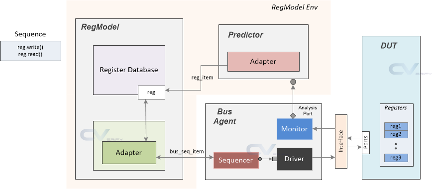
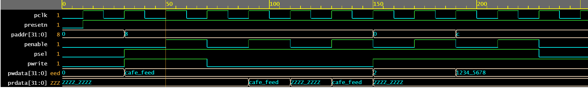
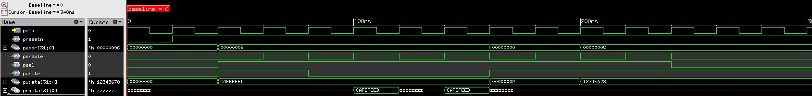
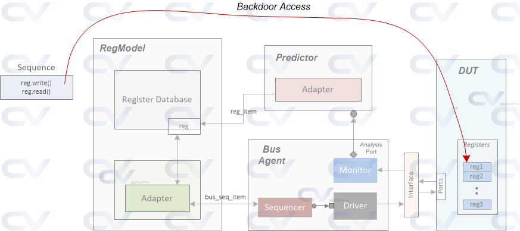
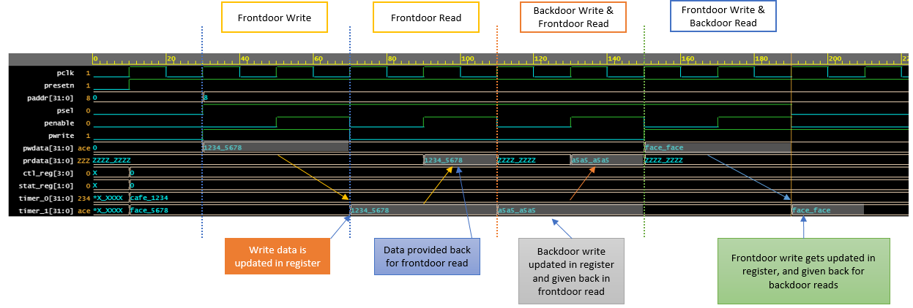
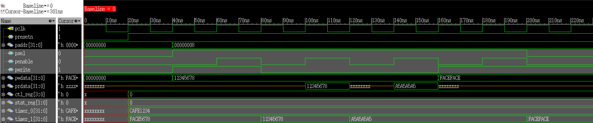

# UVM_Traffic_RAL

## Project Description

This repository organizes the ChipVerify website code so that it is executable in a verification environment that uses the Register Abstraction Layer (RAL), as well as adding new features to the testbench.

[UVM Register Model Example source code from ChipVerify](https://www.chipverify.com/uvm/uvm-register-model-example)

The above application refers to frontdoor access, as it performs writes and reads using the register model. However, there is also backdoor access, which in turn writes and reads directly to the DUT.

[UVM Register Backdoor Access source code from ChipVerify](https://www.chipverify.com/uvm/uvm-register-backdoor-access)

## 🔨 Project Features

### Frontdoor Access
The model implemented for the abstraction layer of the registers is represented according to <b>Figure 1</b>, as well as its buses (CTL, STAT, TIMER_0 and TIMER_1) and respective fields.

#### Figure 1 - Register Abstraction Layer Model

##### Source: <https://www.chipverify.com/images/uvm/design.png>
 

The abstraction used was the frontdoor, as illustrated in <b>Figure 2</b>.
#### Figure 2 - Frontdoor Access

##### Source: <https://www.chipverify.com/images/uvm/regmodel_env.png>
 

The result of the *traffic_reg_rw_test* is illustrated in the waveform in Figure 3.

#### Figure 3 - Waveforms from traffic_reg_rw_test

##### a) ChipVerify - Source: <https://www.chipverify.com/images/uvm/waves/reg_model_example_wave1.png>

##### b) Author
 

### Backdoor Access
As Figure 4 illustrates, backdoor access does not use the logger model and goes directly to the under test design.

#### Figure 4 - Register Abstraction Layer Model with Backdoor Access

##### Source: <https://www.chipverify.com/images/uvm/uvm-register-backdoor-access.png>
 

The result of the *traffic_reg_rw_backdoor_test* is illustrated in the waveform in Figure 5.

#### Figure 5 - Waveforms from traffic_reg_rw_backdoor_test

##### a) ChipVerify - Source: <https://www.chipverify.com/images/uvm/waves/uvm-register-backdoor-access-wave.png>

##### b) Author
 

Obs (1): There is also another test called *traffic_reg_ro_backdoor_test*, for testing the Read Only registers. Although the results shown in the xrun.log file of the simulation are correct, the waveform is not coherent because RTL allows writing to this register. In other words, the RAL model is correct (according to the specification), but the DUT allows writing to the register.

Obs (2): To use an integrated UVM register test as an example, there is the option of starting the native sequence *uvm_reg_hw_reset_seq*, which checks if the reset values of the registers are in conformity with the RAL model.
 

## 🛠️ Execute the project

The Makefile in the `testbench/rundir/` directory has the following options:
- `make frontdoor`: Run the frontdoor read write test with Xcelium Logic Simulator from Cadence;
- `make backdoor_rw`: Run the backdoor read write test with Xcelium Logic Simulator from Cadence;
- `make backdoor_ro`: Run the backdoor read only test with Xcelium Logic Simulator from Cadence;
- `make <some_test_name_above> ARGS=-gui`: Run the simulation using Simvision's GUI for some test.

## 📚 More about me

`in` [My LinkedIn](https://www.linkedin.com/in/marley-lobao-de-sousa/)
