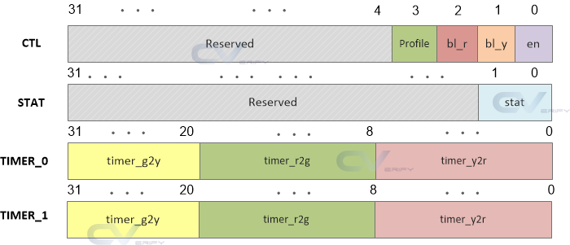

# UVM_Traffic_RAL
This repository organizes the ChipVerify website code so that it is executable in a verification environment that uses the Register Abstraction Layer (RAL).

[UVM Register Model Example source code from ChipVerify](https://www.chipverify.com/uvm/uvm-register-model-example)

 
The model implemented for the abstraction layer of the registers is represented according to <b>Figure 1</b>, as well as its buses (CTL, STAT, TIMER_0 and TIMER_1) and respective fields.

#### Figure 1 - Register Abstraction Layer Model

##### Source: <https://www.chipverify.com/images/uvm/design.png>
 

The abstraction used was the frontdoor, as illustrated in <b>Figure 2</b>.
#### Figure 2 - Frontdoor Access

##### Source: <https://www.chipverify.com/images/uvm/regmodel_env.png>
 

The result of the *traffic_reg_rw_test* is illustrated in the waveform in Figure 3.

#### Figure 3 - Waveforms from traffic_reg_rw_test

##### a) ChipVerify - Source: <https://www.chipverify.com/images/uvm/waves/reg_model_example_wave1.png>

##### b) Author
 